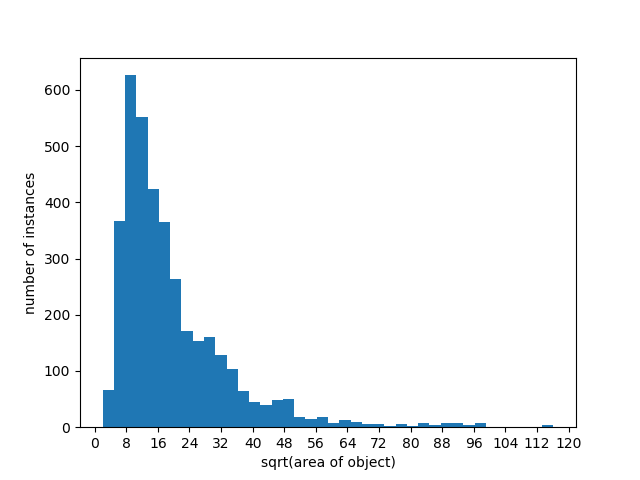

# P_mask_RCNN for pulmonary embolism(PE) detection and segmentation

This is an implementation of P_Mask RCNN
on Python 3, Keras, and TensorFlow>=1.10, <2.0. The code inherits from [Mask RCNN]
(https://github.com/matterport/Mask_RCNN). We mainly modified its RPN part. 
Our method has a better performance on small object detection. 


The repository includes:
* the source code of Mask RCNN
* the source code of constructing Guassian mixture model(GMM) and the implements of 
the Expectation-Maximization(EM) algorithm
* the source code of sample from GMM
* the source code of the RPN model of P_mask_RCNN

#Data Description
to reproduce the results of the experiment in our paper, you should download the PE dataset
from [here](https://figshare:com/authors/MojtabaMasoudi/5215238).

The dataset is provided in dicom form, you should change it to jpg form, first. After that,
you should generate a label file for the coco dataset using the mask label provided by the dataset, 
and replace the file in the [annotations](annotations) directory.
you can also use the label file provided by us. If you use our label files, 
You need to rename each image in the following format: "%2d%3d.jpg" % (patient_id, slice_index),
and divide the data set to 3 parts, including: train, test and val, with the image name contained in each label file. 

The dataset includes 35 patients. A total of 8,792 CTPA images with
the size of 512×512 pixels are included, of which 2,304
contained lesion areas with 3781 PE regions of interest(PE-ROIs) altogether.More than 85% of these PE-ROIs are small
objects with the square root of the area≤32 pixels which only
occupy on average 0.3% of the image area.


#Getting started
Install the required package:
```
pip install -r requirements.txt
```

* [sampling.sample.py](sampling/sample.py) is the module to build GMM and sample points from GMM and save it to the 
[locations](locations) directory. you can run it and plot the GMM in a 3D Coordinate System.
```
python sampling/sample.py
```
the result are as follows:
<figure class="half">
    
    
</figure>

* [pulmonary_embolism.py](pulmonary_embolism.py) is the main file to train and validate P_Mask_RCNN.
You can download pre-trained COCO weights (mask_rcnn_coco.h5) from the [releases page](https://github.com/matterport/Mask_RCNN/releases)
to init the weight of the model.You can also use the [model](model/mask_rcnn_pulmonary.h5) we have pre-train to evaluate P_Mask_RCNN directly.

To train your own model, run:
```
python pulmonary_embolism.py training --dataset="your dataset path" --model="your model weight file.h5"
```
To evaluate the model, run:
```
python pulmonary_embolism.py inference --dataset="your dataset path" --model="your model weight file.h5"
```


 


